# Bedienung

Diese Anleitung richtet sich an alle, die `thermoctl` benutzen — nicht betreiben. Wer
die Anlage einrichtet, eine eigene Instanz aufsetzt oder scharf schaltet, findet das in
[self-hosting.md](self-hosting.md), [inbetriebnahme-schattenbetrieb.md](inbetriebnahme-schattenbetrieb.md)
und [scharfschalten.md](scharfschalten.md). Hier geht es um die beiden Oberflächen selbst.

**Ein Fachbegriff, den die Oberfläche nicht erklärt?** Das [Glossar](glossar.md) erklärt
sie in einfachen Worten — dieselben Texte stehen in der Oberfläche unter **Hilfe →
Glossar** (Anlagensicht, Seitenleiste) bzw. im Fußbereich jeder Seite. Neben schwierigen
Einstellungen führt ein kleines Fragezeichen direkt zum passenden Eintrag.

**Welche Oberfläche jemand sieht, entscheidet seine Gruppe, nicht sein Wunsch.** Es gibt
zwei: die **Anlagensicht** für Verwaltung und Technik, und die **Wohnungssicht** für
die Bewohner eines oder mehrerer Räume. Was jemand in seiner Oberfläche sehen *darf*,
regeln zusätzlich die Rechte seiner Gruppe — eine Wohnungssicht-Gruppe kann z. B. für
einen Raum zuständig sein und für einen anderen nicht.

## Anlagensicht

Für Verwalter, Haustechnik und alle, die die ganze Anlage im Blick behalten.

### Übersicht

Die Startseite zeigt jede Zone als eigene Karte: Ist-Temperatur und wie alt die Messung
ist, aktueller Sollwert samt Begründung (Zeitplan, Übersteuerung, Frostschutz …), die
aktuelle Heizentscheidung und ein Band mit dem Tagesplan der nächsten 24 Stunden — je wärmer
der Ton, desto höher der Sollwert, der senkrechte Strich markiert „jetzt". Oben stehen
drei Zustandsanzeigen: ob die Regelung im Trockenlauf oder scharf ist, ob die
MQTT-Ausgabe (der beim Prozessstart gebaute zweite Riegel) noch gesperrt ist, und —
falls mehrere Instanzen denselben Bestand teilen — welche Rolle diese Instanz gerade
hat. Darunter steht, ob eine Außentemperaturquelle gewählt ist, und — sobald ein
Urlaub angesetzt oder geplant ist — der Chip „Urlaub geplant" (bzw. „Urlaub läuft"),
verlinkt zur Urlaubsseite (siehe Abschnitt „Urlaub" unten).

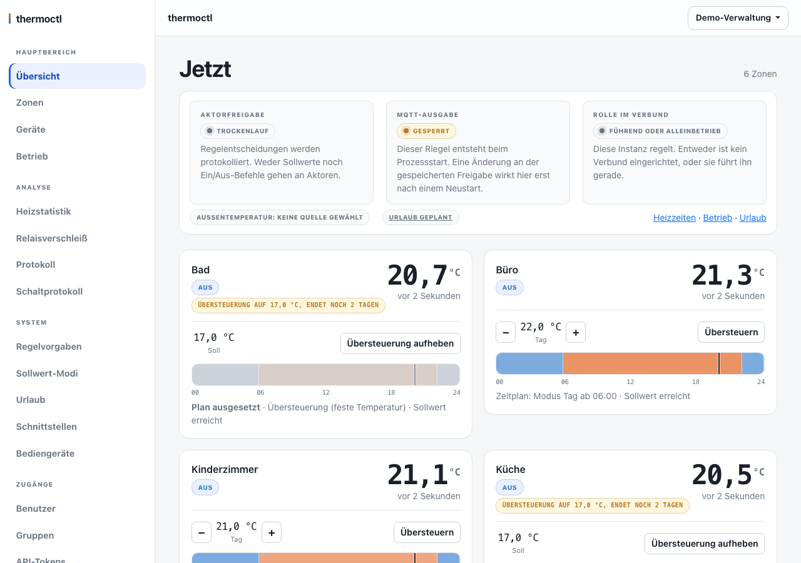

Weiter unten:

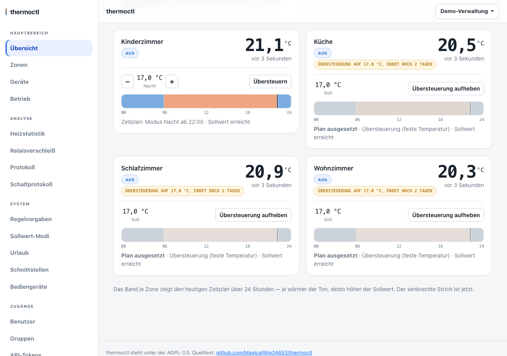

### Zonen, Wochenplan und Sollwerte

Unter **Zonen** stehen alle Räume mit ihrer Betriebsart und Verweisen auf Geräte und
Zeitplan. Eine Zone anzulegen braucht nur einen Namen — Geräte, Sollwerte und Zeitplan
kommen danach dazu.

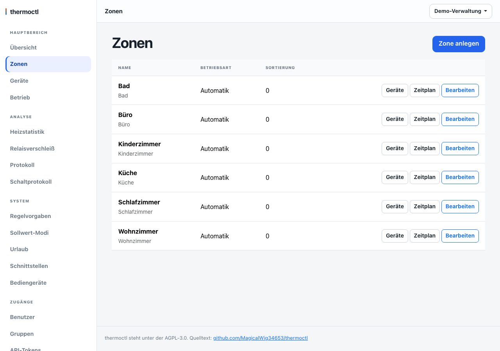

Der **Wochenplan** einer Zone zeigt sieben Tage nebeneinander als Farbbalken — je Modus
eine Farbe — und darüber eine Vorschau der nächsten 24 Stunden, die auch eine gerade
laufende Übersteuerung berücksichtigt. Schaltpunkte lassen sich per Klick auf einen Balken
setzen, im Formular darunter eintragen oder mit „Zeit malen" über ein Zeitraster ziehen.
Ein kompletter Plan lässt sich von einer anderen Zone übernehmen, statt ihn noch einmal
einzutragen.

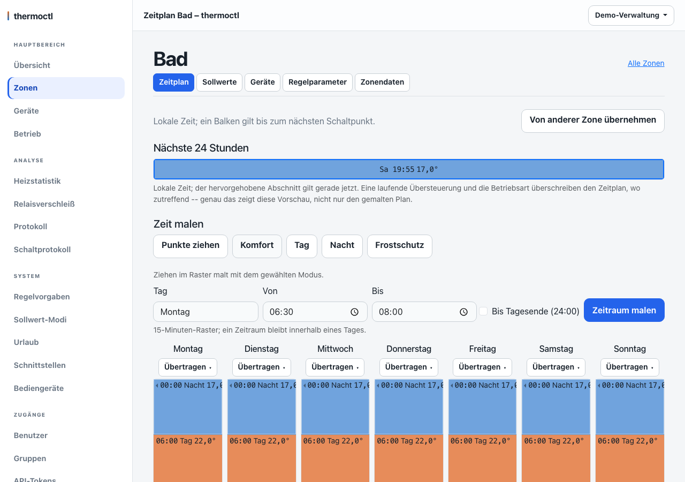

Weiter unten:

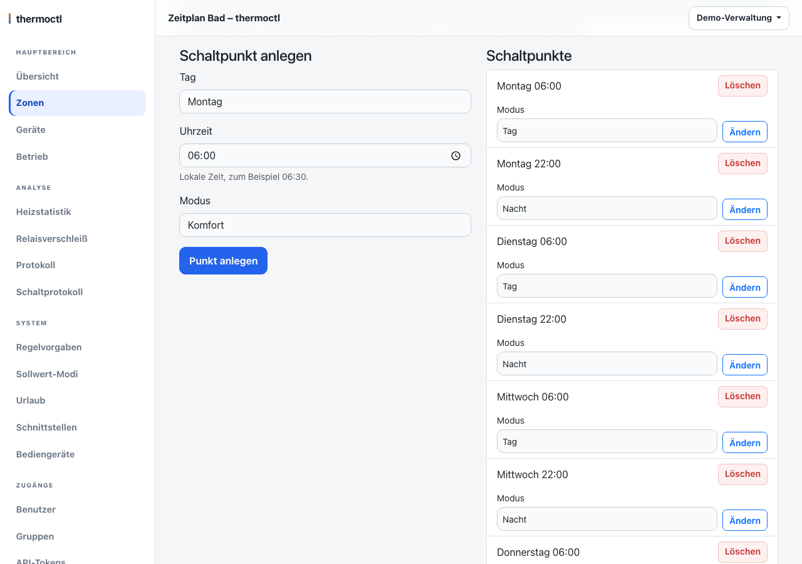

Die **Sollwerte** einer Zone legen fest, welche Temperatur zu welchem Modus gehört
(Komfort, Tag, Nacht, Frostschutz). Ein leeres Feld löscht den Sollwert für diesen
Modus — die Zone erbt dann den anlagenweiten Vorgabewert.

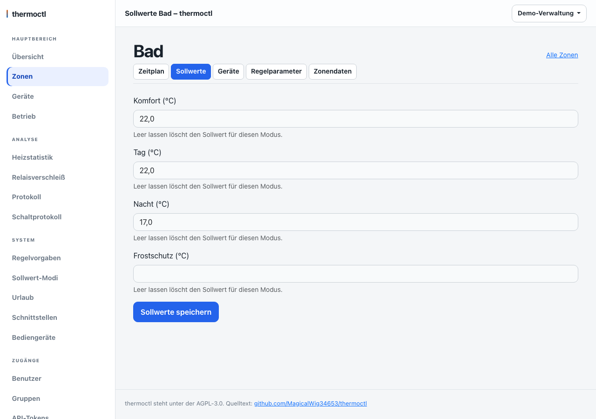

### Geräte

Die Geräteliste zeigt alle bekannten Geräte mit ihrer Zone, ihrem Verbindungsstatus
(Zigbee2MQTT-Signalstärke und Batterie, oder „hat sich noch nie gemeldet", solange noch
keine MQTT-Nachricht einging; bei Meross-Geräten, die sich nie über MQTT melden, sondern
nur stündlich beim Geräteabgleich mit der Cloud, steht stattdessen „wurde noch nie als
online abgeglichen") und ihren Fähigkeiten —
Temperaturmessung, Schaltausgang oder Thermostatventil. Zonen ohne Meldung stehen oben
gesondert, damit sie auffallen. Ein Gerät wird per Ziehen und Ablegen einer Zone
zugeordnet.

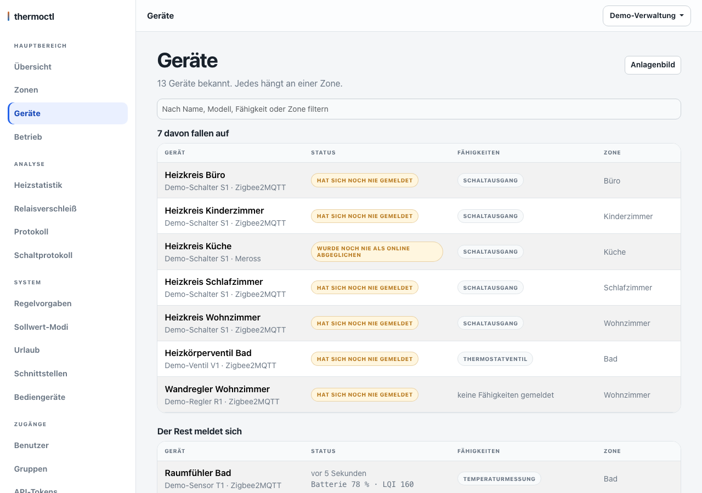

Weiter unten:

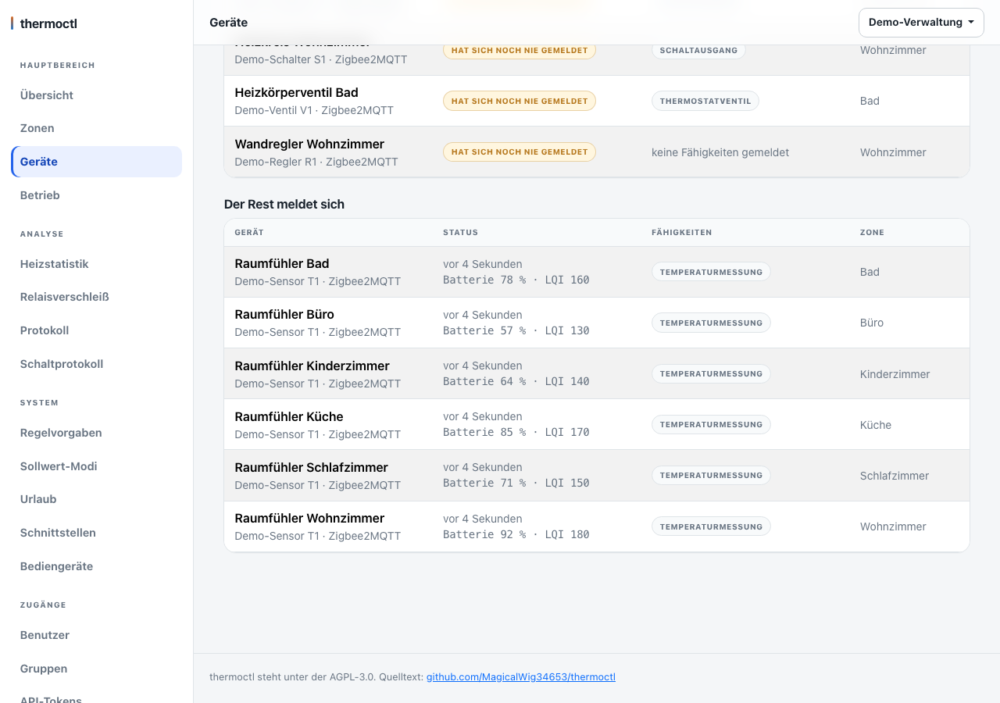

### Betrieb: Trockenlauf und Scharfschalten

**Betrieb** ist der Ort, an dem entschieden wird, ob die Anlage wirklich schaltet. Im
**Trockenlauf** — der Vorgabe nach jeder Einrichtung — protokolliert die Regelung nur,
was sie täte; es geht nichts an ein Gerät hinaus. Darunter steht für jede Zone Ist-Wert,
Sollwert und die aktuelle Ein/Aus-Entscheidung. Die genaue Reihenfolge des
Scharfschaltens (Begründung eintragen, danach neu starten) steht in
[scharfschalten.md](scharfschalten.md).

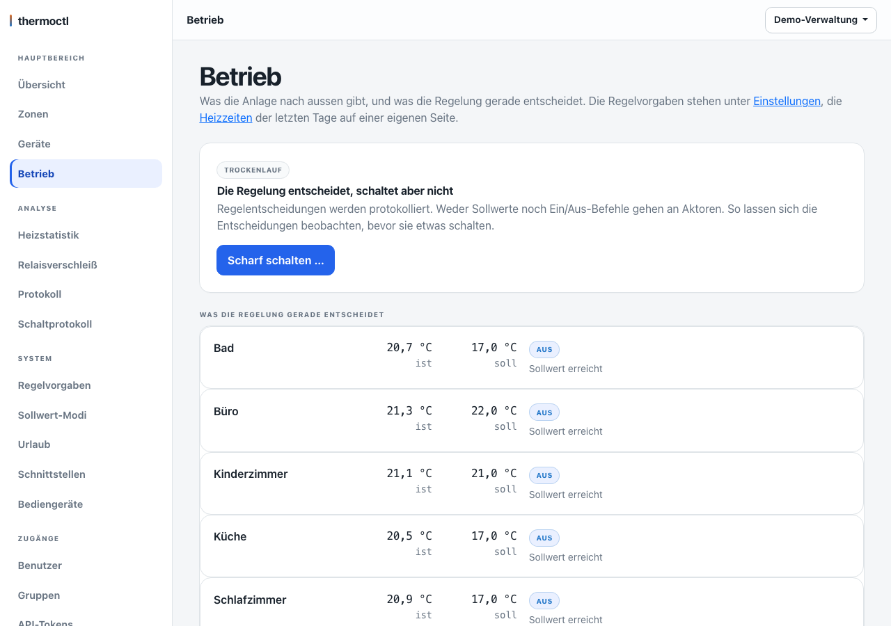

Weiter unten:

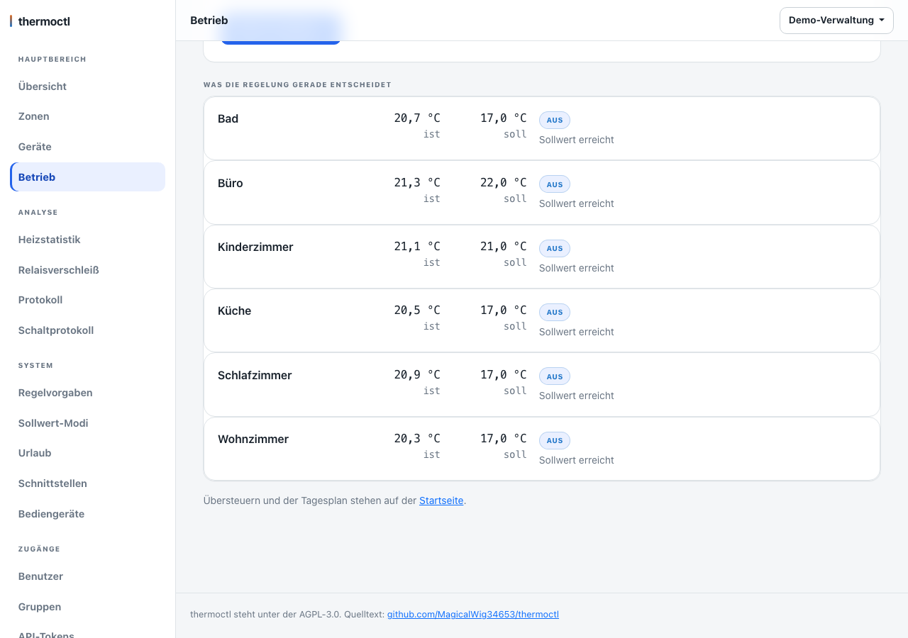

Läuft eine Zone im **Notbetrieb** (siehe [Notbetrieb bei Sensorausfall](#notbetrieb-bei-sensorausfall)
unten) oder gibt es einen Vergleich von Ersatzquelle und Wandfühler, steht unter ihrer
Zeile ein eigener Kasten „Notbetrieb": die Stufe, die aktive Quelle, bei der Rückkehrprüfung
der Fortschritt (Messwerte von nötigen zwei), die Sendefreigabe (scharf oder Trockenlauf)
und je Aktor Takt-Phase, Frist, Übergabe und Rückstellung. Darunter der **Vergleich
Ersatzquelle ↔ Wandfühler** der letzten Tage: je Thermostat die Zahl der Messwerte, die
mittlere Abweichung und ein **vorgeschlagener Ausgleichswert** — eine Grundlage für die
Kalibrierung, die man unter den Regelparametern der Zone einträgt, kein Wert, der sich von
selbst übernimmt.

### Schaltprotokoll

Jeder Befehl, der wirklich an ein Gerät hinausging oder im Trockenlauf unterdrückt bzw.
verworfen wurde, steht im **Schaltprotokoll** — mit Zeitpunkt, Zone, Gerät, gesendetem
Befehl, Ergebnis und aufklappbarer Begründung. Filter nach Zeitraum, Zone und Ergebnis
grenzen lange Listen ein. Wie man ein unauffälliges Protokoll von einem mit echtem
Problem unterscheidet, erklärt [scharfschalten.md](scharfschalten.md#4-wie-man-das-schaltprotokoll-liest).

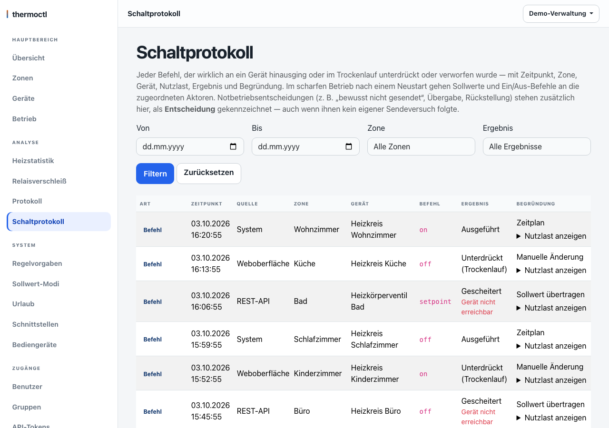

### Benutzer, Gruppen und Rechte

Unter **Benutzer** werden Konten angelegt, deaktiviert und einer Gruppe zugeordnet. Ein
Konto ohne Gruppe hat keinerlei Rechte. Von hier aus lässt sich auch das eigene Passwort
ändern und jede andere angemeldete Sitzung dieses Kontos beenden — etwa nach einem
verlorenen Gerät.

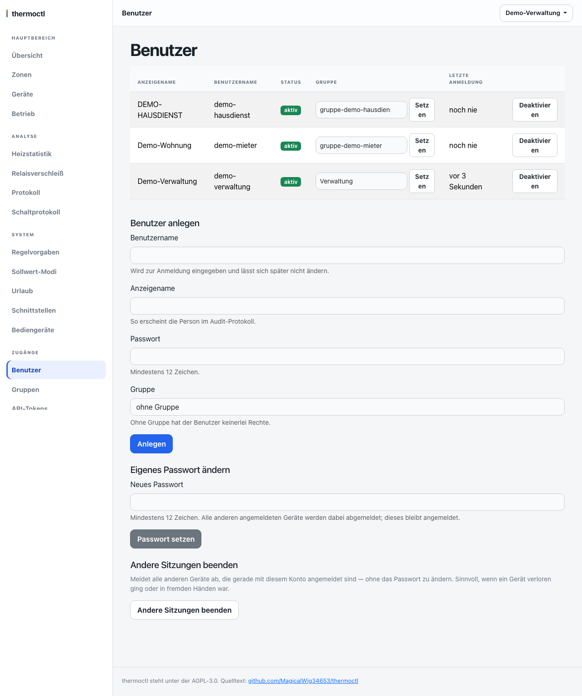

Weiter unten:

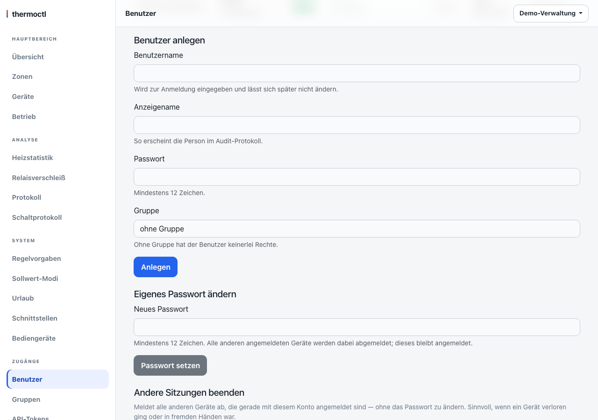

**Rechte hängen an Gruppen, nicht an Personen.** Wer mehreren Gruppen angehört, darf
alles, was mindestens eine davon erlaubt. Vier eingebaute Gruppen decken die üblichen
Fälle ab (Bedienung, Integration, Nur lesen, Verwaltung); eigene Gruppen lassen sich
zusätzlich anlegen. Die Beschränkung auf einzelne Räume passiert nicht beim Anlegen,
sondern danach über „Rechte bearbeiten": Zu jedem zonenbezogenen Recht lässt sich dort
ankreuzen, für welche Zonen es gilt, statt es anlagenweit zu vergeben. Jede Gruppe trägt außerdem ein
**Oberflächen-Profil** — Anlage oder Wohnung —, das bestimmt, welche der beiden
Oberflächen ihre Mitglieder überhaupt zu sehen bekommen. Beim Upgrade behält jede
bestehende Gruppe das Anlagenprofil; für eine Mietergruppe wird das Profil ausdrücklich
auf Wohnung umgestellt.

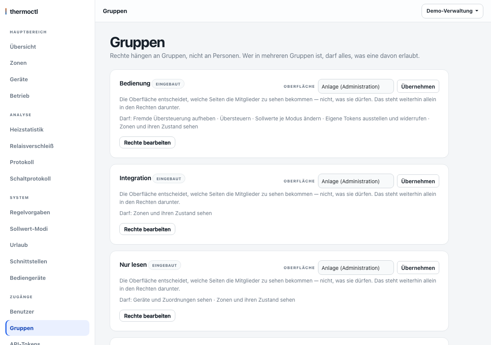

Weiter unten:

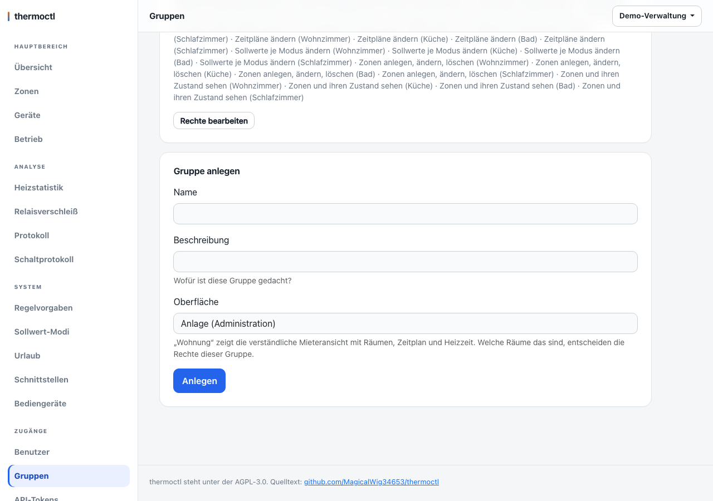

### Kiosk-Token

Für das Wandtablet gibt es unter **Einstellungen → Kiosk-Tokens** einen eigenen
Zugang ohne Benutzerkonto: Ein Token bekommt einen Namen, eine Auswahl an Zonen, die es
sehen darf, optional die Erlaubnis zu bedienen (sonst zeigt es nur an), und optional eine
Gültigkeit in Tagen. Die Adresse `/kiosk/<token>` erscheint danach genau einmal im
Klartext — sie gehört als Lesezeichen aufs Tablet, danach lebt das Token nur noch im
Cookie. Ein Token lässt sich jederzeit widerrufen.

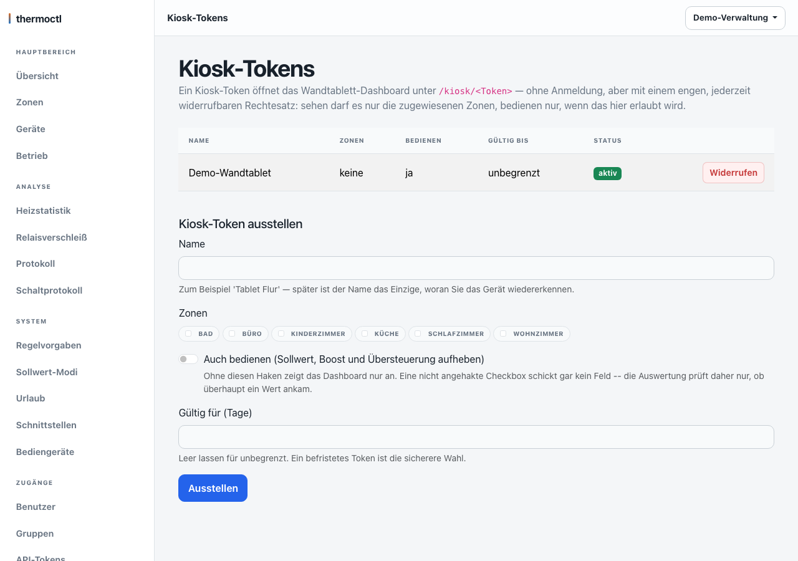

Für kleine Wandpanels gibt es unter `/kiosk?ansicht=panel` eine eigene Ebene mit
einem kompakten Zonenraster; Antippen einer Kachel öffnet ihre Details.
Ohne JavaScript bleibt die scrollende Tafel.

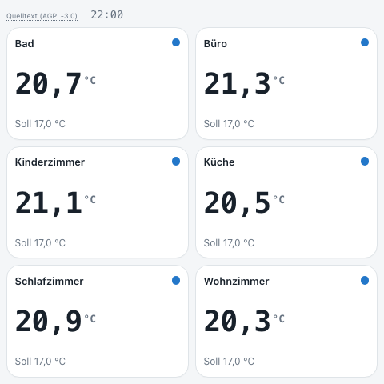

### Einstellungen und Störungsmeldungen

**Regelvorgaben** (`/settings`) fasst die anlagenweiten Werte zusammen, die eine Zone
erbt, solange sie nichts Eigenes einträgt: Regelzyklus, Hysterese, Mindest-Schaltdauern,
Sensor-Timeouts, Fenster-Erkennung, Sonnenabsenkung und sechs Arten von
Störungsmeldungen (Sensorstörung, Brücke/Broker weg, gescheiterter Schaltbefehl,
festhängender Messwert, Fenster vergessen offen, Problemmeldung aus einer Wohnung) —
jede einzeln abschaltbar. Ein Testknopf prüft einen hinterlegten Webhook, ohne auf eine
echte Störung zu warten.

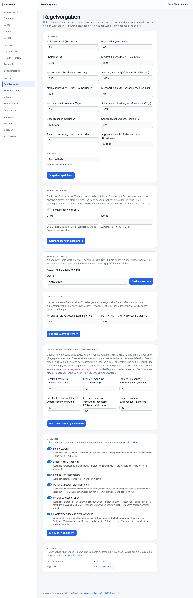

Weiter unten:

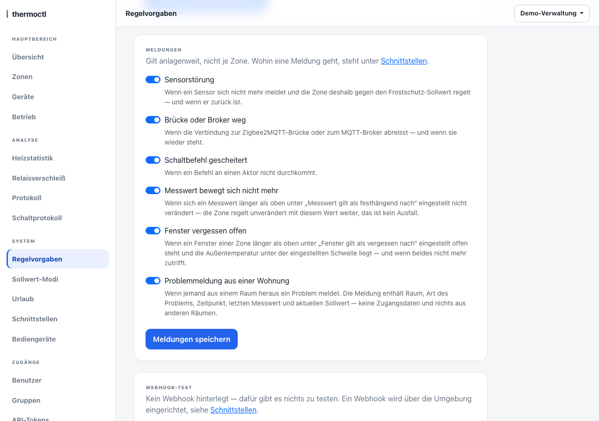

### Notbetrieb bei Sensorausfall

Fällt der Temperatursensor einer Zone aus, regelt `thermoctl` nicht mehr auf eine Messung,
die es nicht mehr gibt. Der Notbetrieb ist für **alle Zonen von Anfang an aktiv** — bei
bestehenden Anlagen seit dem Upgrade auf 0.11, bei neu angelegten Zonen von der Anlage
an. Er geht in Stufen vor:

1. **Ersatzquelle.** Zuerst nimmt die Zone die kälteste Messung der ihr zugeordneten
   Thermostat-Thermometer (korrigiert um den Ausgleichswert) und regelt normal weiter.
   Ein Thermostat, dem `thermoctl` gerade selbst eine Temperatur schreibt, misst dann nur
   das Echo davon und zählt erst 30 Minuten nach dem letzten Schreiben als unabhängig.
2. **Notbetrieb.** Gibt es keine brauchbare Quelle, **takten Fußbodenkreise** — im
   Festtakt (Vorgabe 10 Minuten an, 20 Minuten aus) oder, wenn ein Außenwert vorliegt,
   nach der Außentemperatur-Kennlinie. Der Takt läuft auch im Betriebsmodus „Aus"
   und bei offenem Fenster. **Heizkörper-Thermostate** werden **einmal** auf „manual" und
   den Notsollwert (Vorgabe 20 °C) gestellt und danach nicht mehr angesprochen.
3. **Rückkehrprüfung.** Der Sensor muss zwei verschiedene Messwerte liefern und danach
   60 Sekunden durchgehend brauchbar bleiben. Erst dann geht die Zone zurück in den
   Normalbetrieb; das Thermostat bekommt **einmal** den Betriebsmodus zurück, den es vor
   der Übergabe gemeldet hat. Die Mindest-Ein- und -Aus-Dauern der Fußbodenkreise gelten
   dabei weiter.

Die Anlage meldet je Störung **einmal den Beginn und einmal die Entwarnung** (mit dem
Schalter „Sensorstörung" unter Regelvorgaben abschaltbar). Auf Start, Wohnungssicht und
Kiosk steht ein kurzer Hinweis in Klartext; Details für die Technik zeigt die Betriebsseite
(oben) und das Schaltprotokoll.

**Einstellen** lässt sich der Notbetrieb an zwei Stellen:

- **Regelvorgaben → Karte „Notbetrieb bei Sensorausfall"** (anlagenweit): Festtakt
  (Sekunden an/aus), Rückkehrprüfung (Dauer und Zahl der Messwerte), Wiederanlaufspanne,
  anlagenweiter Notsollwert und die **Außenkennlinie**. Die Kennlinie besteht aus Zeilen
  (Außentemperatur, Sekunden an, Sekunden aus), die sich hinzufügen und entfernen lassen;
  sie braucht mindestens zwei Zeilen und genau einen oberen Punkt, ab dem nicht mehr eingeschaltet
  bleibt, und der Tastgrad darf mit steigender Außentemperatur nicht zunehmen. Eine leere
  Kennlinie heißt Festtakt. Ein Fehler in einer Zeile verwirft die ganze Eingabe.

  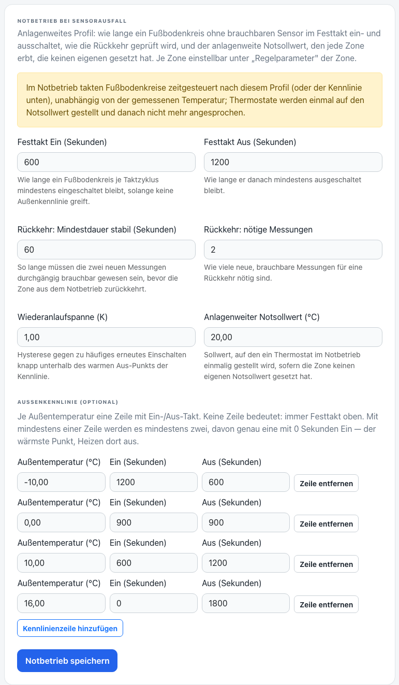

- **Zone → Regelparameter → Abschnitt „Notbetrieb bei Sensorausfall"** (je Zone): den
  Notbetrieb für diese Zone **ausschalten**, ein anderes vorhandenes Profil wählen oder
  einen eigenen Notsollwert setzen (leer = Anlagenwert erben), und je zugeordnetem
  Thermostat den **Ausgleichswert** (Recht `device.manage` nötig). Daneben stehen die
  wirksamen Werte und woher sie stammen. Der Abschnitt gehört zum selben Formular wie die
  übrigen Regelparameter, mit einem gemeinsamen Speichern-Knopf. Mehrere Profile
  anzulegen ist nicht vorgesehen; es gibt das eine anlagenweite Profil.

  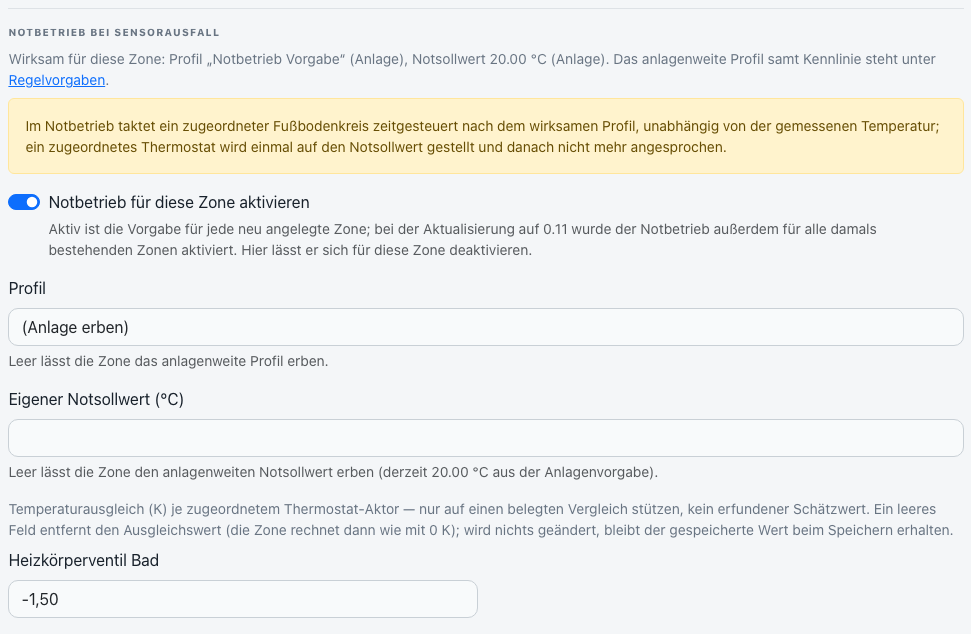

**Wichtig zu wissen:** Im Notbetrieb takten Fußbodenkreise nach der Uhr, **unabhängig von der
Raumtemperatur**. Das ist eine Notlösung für den Ausfall, keine Regelung; wer eine Zone
dauerhaft so betreibt, sollte den Sensor reparieren.

### Statistik und Relaisverschleiß

**Heizstatistik** zeigt, wie lange je Zone eine Heizanforderung bestand. Die Zahlen zeigen
Regelentscheidungen, keine bestätigte körperliche Heizwirkung. **Relaisverschleiß**
zählt Schaltspiele je Gerät und Tag und rechnet sie auf ein Jahr hoch, verglichen mit einer
angenommenen Relais-Lebensdauer (Vorgabe 500.000 Schaltspiele — eine Annahme, keine
Herstellerangabe, einstellbar unter Regelvorgaben). Nützlich unabhängig davon, ob eine Zone
die PI-Regelung nutzt: Auch die gewöhnliche Hysterese verschleißt ein Relais, nur langsamer.

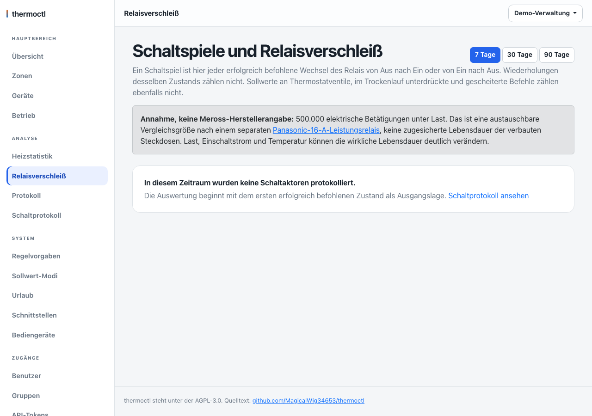

### Urlaub

Unter **Urlaub** (`/vacation`, Recht `vacation.manage`) lässt sich ein einziger
Absenkwert für **die ganze Anlage** über einen zusammenhängenden Zeitraum ansetzen —
erster und letzter Tag, dazu die Temperatur, auf die währenddessen jede Zone abgesenkt
wird. Fenster, Sensorausfall, Mindestschaltdauern und Ventilschutz gelten dabei
unverändert weiter, und eine Zone in Betriebsart „Aus" bleibt aus. Ein bereits geplanter
oder laufender Urlaub zeigt seinen Zustand als Chip — „Geplant" oder „Läuft" — samt
Beginn, Ende und Absenkwert, und lässt sich vorzeitig beenden; ein zweiter Urlaub muss
den bestehenden erst beenden. Eine einzelne, von Hand gesetzte Übersteuerung einer Zone
geht dabei nicht verloren — sie gilt weiter, bis sie selbst endet.

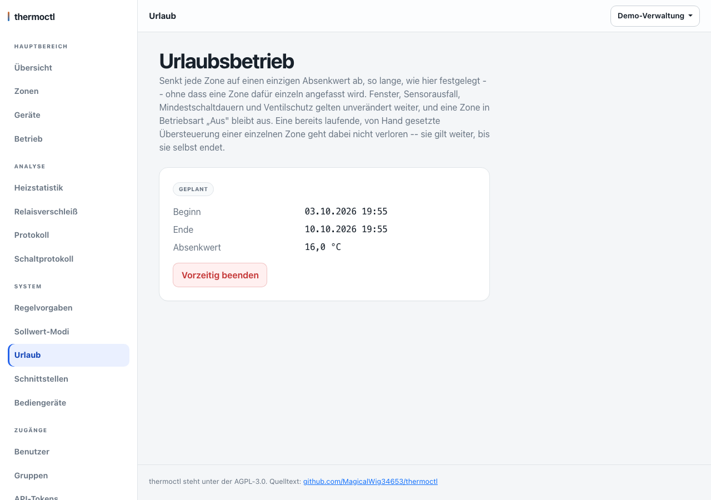

**Zu unterscheiden von der Abwesenheit der Wohnungssicht** (siehe dort): Der Urlaub hier
ist anlagenweit und wird von der Verwaltung gesetzt: er betrifft alle Zonen der Anlage,
unabhängig davon, wer in welchem Raum wohnt. Die Abwesenheit in der Wohnungssicht setzt
dagegen jeder Bewohner für die eigenen Räume selbst, unabhängig von der übrigen Anlage.
Beide Funktionen sind technisch getrennt und lassen sich nicht gegenseitig auslösen oder
beenden.

## Wohnungssicht

Für die Bewohner eines oder mehrerer Räume — ohne Fachbegriffe, ohne Zugriff auf
Technik, Geräte oder andere Räume. Dieser Abschnitt richtet sich an die Verwaltung, die
wissen muss, was ihre Mieter sehen und dürfen. **Zum Weitergeben an Bewohner** gibt es
die eigenständige, technikfreie **[Wohnungs-Anleitung](wohnung.md)** — sie deckt
denselben Funktionsumfang ab, ohne jeden Verweis auf Anlagensicht oder Technik.

### Zuhause: Temperatur und vorübergehende Änderungen

Die Startseite **Zuhause** zeigt jeden zugewiesenen Raum als Karte: Ist-Temperatur samt
Messalter, aktueller Sollwert, eine kurze Begründung („Warum?") und ein Farbband mit dem
heutigen Verlauf. Läuft gerade eine vorübergehende Änderung, steht sie hervorgehoben mit
Enddatum und einem „Beenden"-Knopf darüber. Darunter drei Möglichkeiten, den Raum
vorübergehend anders zu stellen:

- **Die Knöpfe „−"/„+"** (nur sichtbar, solange gerade keine vorübergehende Änderung
  läuft) ändern die normale Temperatur des aktuell laufenden Zeitplan-Abschnitts **dauerhaft**
  — nicht nur für heute. Wer abends auf 21,5 °C stellt, hat damit ab sofort jeden Abend
  21,5 °C, bis er es wieder ändert. Deutlich von den drei folgenden, nur vorübergehenden
  Möglichkeiten unterschieden, damit niemand aus Versehen den Dauerwert trifft, wenn er
  nur kurz wärmer haben wollte.
- **„Für eine Weile wärmer"** setzt eine feste Temperatur bis zu einem selbst gewählten
  Zeitpunkt; danach gilt automatisch wieder der Wochenplan.
- **„Zur nächsten Schaltzeit springen"** nimmt vorweg, was der Zeitplan ohnehin als
  Nächstes vorsieht.
- **„Laufende Änderung ersetzen"** überschreibt eine bereits laufende vorübergehende
  Änderung durch eine neue, statt sie erst beenden zu müssen.

Ein „Problem melden" je Raum schickt eine Meldung an die Verwaltung — Raum, letzter
Messwert und Sollwert werden automatisch angehängt, es sind keine technischen Angaben
nötig.

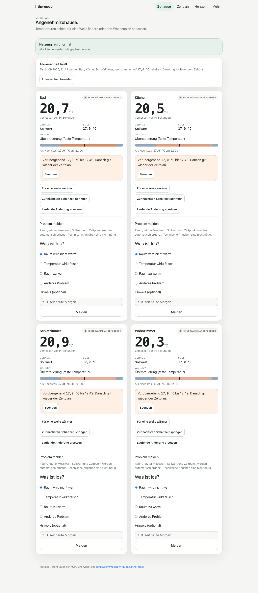

Weiter unten:

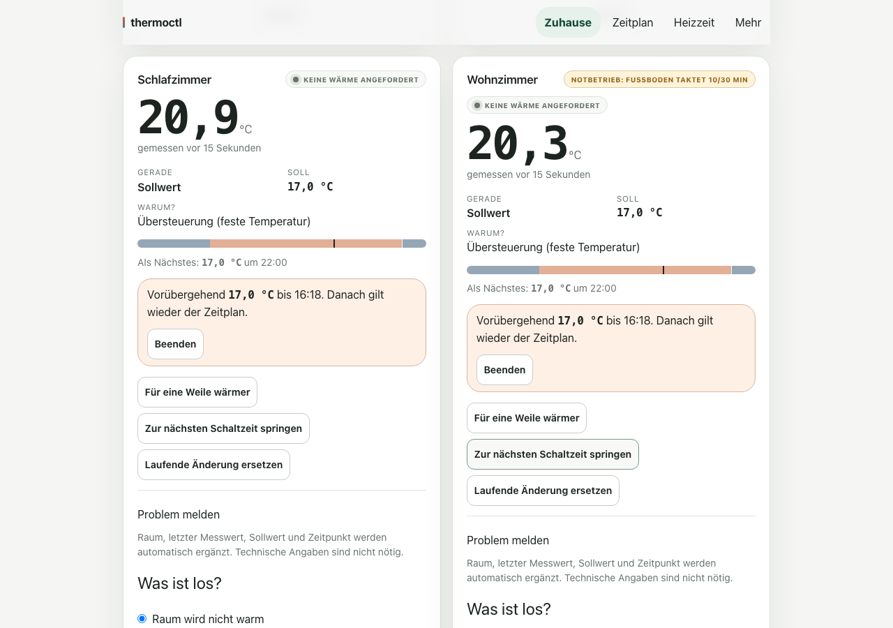

### Wochenplan

Anders als in der Anlagensicht trägt die Wohnungssicht keine Modi und keine Uhrzeiten
minutengenau ein — sie fragt nur, wann es warm sein soll: eine Zeit für „Tag ab" und eine
für „Nacht ab", je Wochentag, mit der Möglichkeit, einen Tag auf die ganze Woche oder auf
Montag–Freitag zu übertragen. Eine Vorschau der nächsten 24 Stunden zeigt, wie der
Sollwert dadurch verläuft — einschließlich einer gerade laufenden vorübergehenden
Änderung. Ein kompletter Plan lässt sich auch hier auf einen anderen eigenen Raum übertragen.

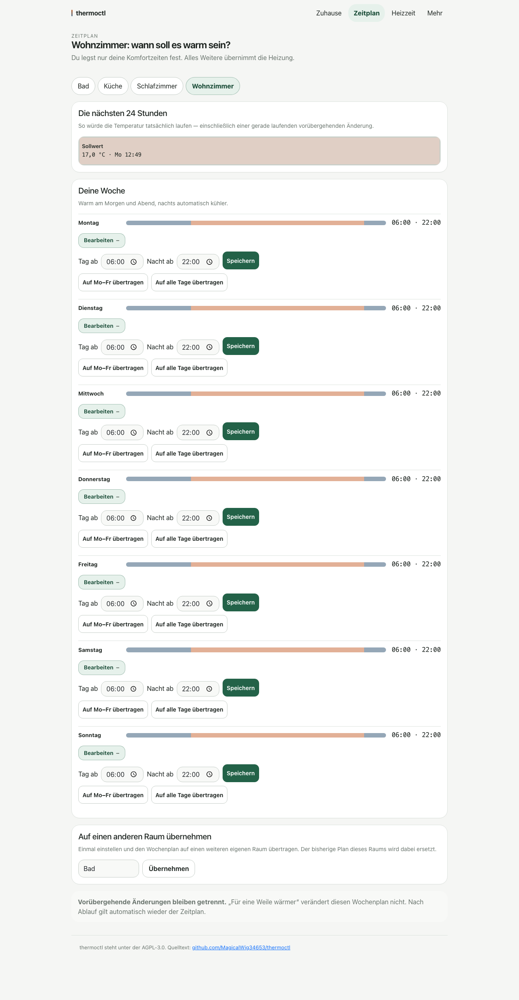

Weiter unten:

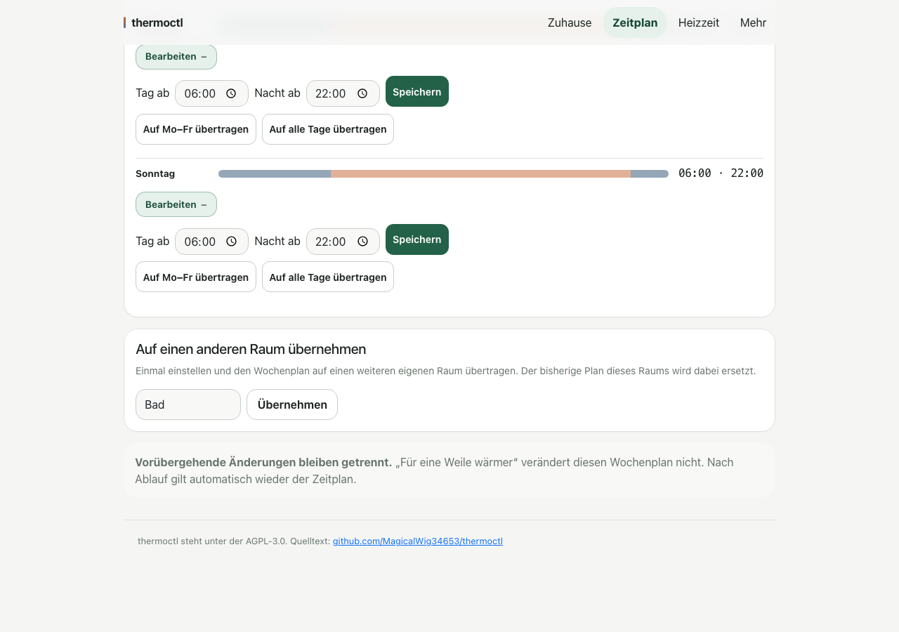

### Heizzeit

**Heizzeit** zeigt je Raum, für wie viele Stunden in den letzten 7, 30 oder 90 Tagen eine
Heizanforderung bestand — als einfache Orientierung, ausdrücklich **kein** Energie- oder
Kostenmesser und keine Bestätigung einer körperlichen Heizwirkung: Wie warm ein Raum dabei
tatsächlich wurde, hängt zusätzlich von Außentemperatur, Gebäudezustand und Lüften ab.
Läuft die Anlage im Trockenlauf, weist ein Hinweis darauf hin, dass die Balken zeigen,
wann *geheizt worden wäre*, nicht was wirklich geschah.

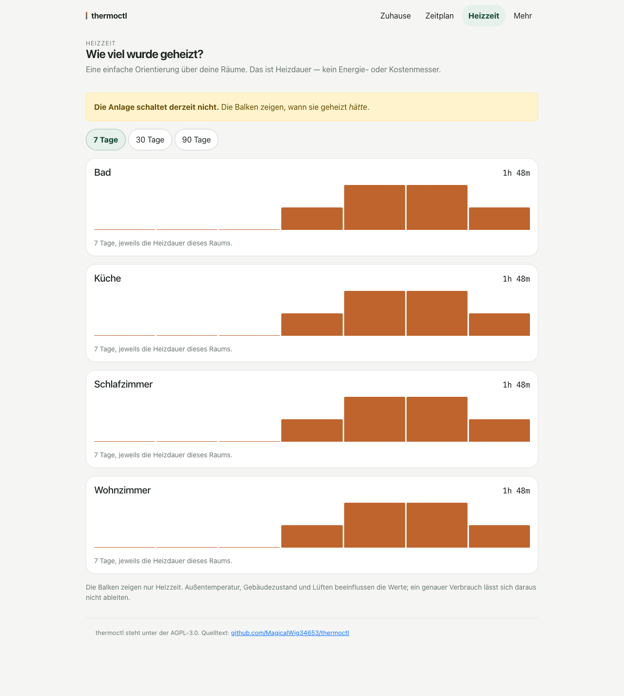

Weiter unten:

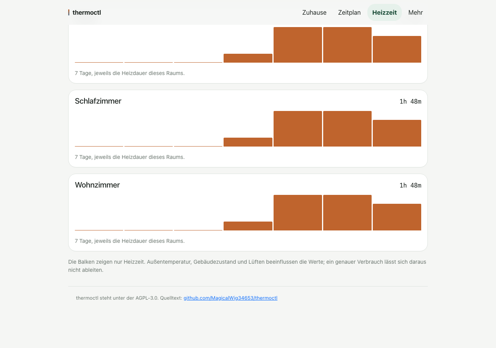

### Abwesenheit

Direkt auf der Startseite **Zuhause**, oberhalb der Raumkarten, lässt sich eine
Abwesenheit einstellen: „Zurück am" und eine Temperatur, auf die währenddessen **alle**
eigenen Räume gemeinsam gehalten werden — nicht raumweise wählbar, weil eine Abwesenheit
per Definition die ganze Wohnung betrifft. Der Wochenplan bleibt dabei unverändert und
gilt automatisch wieder, sobald die Abwesenheit endet oder das Datum erreicht ist. Läuft
gerade eine, erscheint sie als eigener Kasten mit Enddatum und einem „Abwesenheit
beenden"-Knopf, unabhängig von einzelnen, parallel laufenden Raum-Übersteuerungen. Das
ist eine eigene, wohnungsbezogene Funktion — zu unterscheiden vom anlagenweiten „Urlaub"
in der Anlagensicht, der von der Verwaltung für die ganze Anlage gesetzt wird.

*(Siehe Bildbeispiel im Abschnitt „Zuhause" oben — derselbe Screenshot zeigt eine laufende
Abwesenheit.)*

### Mehr: Konto und Sicherheit

Unter **„Mehr"** (`/account`) liegt der persönliche Bereich — keine Anlagenparameter,
unabhängig von jedem sonstigen Recht für jeden Angemeldeten erreichbar. Dort lässt sich
das eigene Passwort ändern (danach bleibt nur das gerade genutzte Gerät angemeldet, alle
anderen brauchen eine neue Anmeldung), jede andere Sitzung dieses Kontos auf einmal
beenden, eine Kurzerklärung der Anzeigen aufrufen, und sich abmelden. Ist für die Anlage
eine Passkey-Anmeldung eingerichtet, erscheint hier zusätzlich ein Verweis auf
„Passkeys verwalten" — ohne diese Einrichtung bleibt der Abschnitt schlicht weg, statt
eine Möglichkeit zu zeigen, die nicht funktioniert.

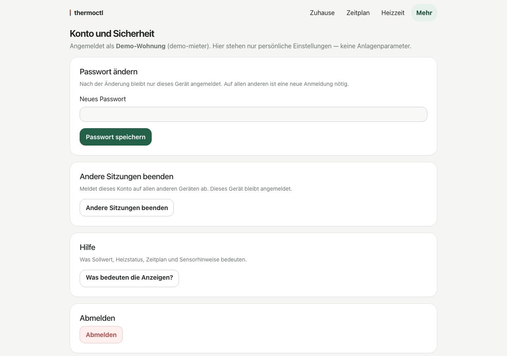
