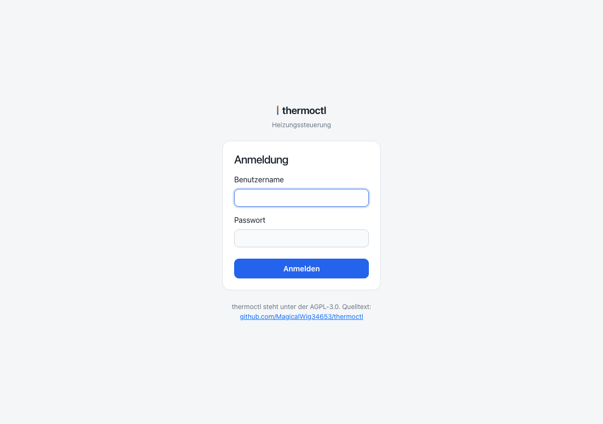
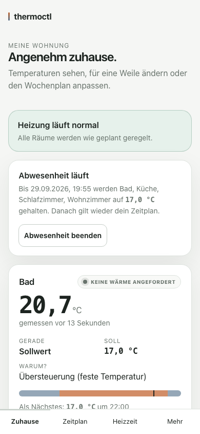
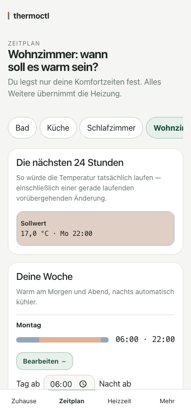
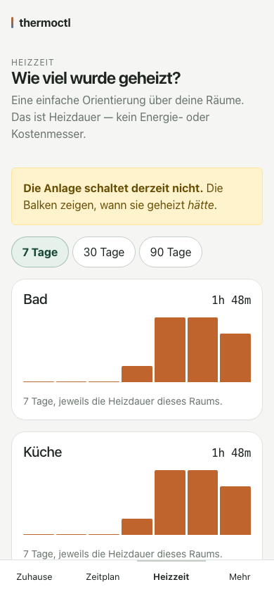
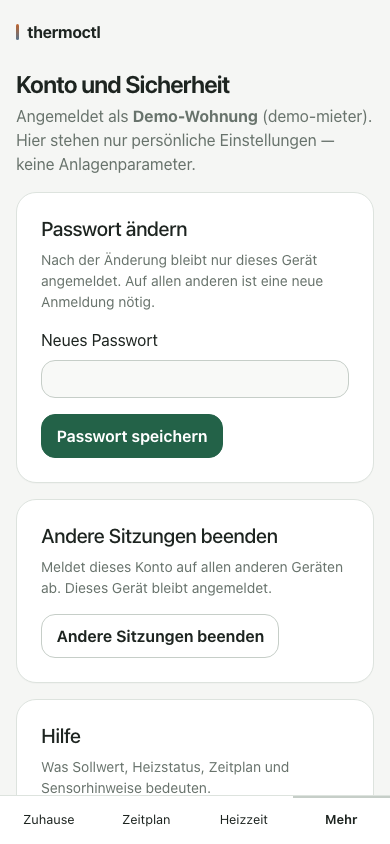

# Ihre Wohnung online steuern

Diese Anleitung erklärt, wie Sie Ihre Heizung über den Webbrowser sehen und bedienen —
vom Handy, Tablet oder Computer aus. Sie brauchen dafür nichts zu installieren und
nichts einzurichten: Die Zugangsdaten (Adresse, Benutzername, Passwort) haben Sie von
der Verwaltung Ihrer Anlage erhalten.

## Anmelden

Rufen Sie die Ihnen genannte Adresse im Browser auf. Es erscheint eine Anmeldeseite mit
Benutzername und Passwort.

Nach der Anmeldung sehen Sie oben vier Reiter: **Zuhause**, **Zeitplan**, **Heizzeit**
und **Mehr**. Sie sehen darin ausschließlich die Räume, für die Sie freigeschaltet
wurden — nie andere Wohnungen oder Technik der Anlage.

## Zuhause: Ihre Räume auf einen Blick

Auf der Startseite steht für jeden Ihrer Räume eine eigene Karte: die gemessene
Temperatur, seit wann sie gilt, der aktuelle Sollwert und eine kurze Erklärung, warum
gerade dieser Wert gilt. Darunter ein Balken, der zeigt, wie warm es heute laufen soll —
je dunkler, desto wärmer.

Für jeden Raum gibt es mehrere Möglichkeiten, die Temperatur zu ändern:

- **Die Knöpfe „−" und „+"** ändern die normale Temperatur des gerade laufenden
  Zeitabschnitts **dauerhaft** — nicht nur für heute. Stellen Sie abends auf 21,5 °C,
  gilt das ab sofort jeden Abend, bis Sie es wieder ändern. Diese Knöpfe erscheinen nur,
  wenn gerade keine der folgenden, vorübergehenden Änderungen läuft.
- **„Für eine Weile wärmer"** stellt eine Temperatur nur bis zu einem von Ihnen
  gewählten Zeitpunkt ein. Danach gilt automatisch wieder der gewohnte Wochenplan —
  Sie müssen nichts zurückstellen.
- **„Zur nächsten Schaltzeit springen"** nimmt vorweg, was der Wochenplan sowieso als
  Nächstes vorsieht — praktisch, wenn Sie z. B. früher als sonst aufstehen.
- **„Laufende Änderung ersetzen"** erscheint nur, wenn gerade etwas läuft, und ersetzt
  diese laufende Änderung durch eine neue, statt dass Sie sie erst beenden müssten.

Läuft gerade eine solche Änderung, sehen Sie das an einem hervorgehobenen Kasten mit
Enddatum und einem „Beenden"-Knopf.

## Zeitplan: wann es warm sein soll

Im Reiter **Zeitplan** legen Sie je Raum fest, ab wann es tagsüber wärmer und ab wann es
abends kühler sein soll — für jeden Wochentag einzeln, oder auf einmal für die ganze
Woche bzw. für Montag bis Freitag übertragen. Eine Vorschau zeigt, wie die Temperatur
dadurch in den nächsten 24 Stunden tatsächlich verläuft.

Eine kurzzeitige Änderung über „Für eine Weile wärmer" verändert diesen Wochenplan
**nicht** — sobald sie endet, gilt der Plan unverändert weiter.

## Heizzeit: wie viel geheizt wurde

Der Reiter **Heizzeit** zeigt je Raum, wie viele Stunden in den letzten 7, 30 oder 90
Tagen geheizt wurde. Das ist eine grobe Orientierung — **kein** Energie- oder
Kostenmesser. Wie warm ein Raum dabei tatsächlich wurde, hängt auch vom Wetter, vom
Gebäude und vom Lüften ab. Steht oben ein gelber Hinweis, dass die Anlage derzeit nicht
schaltet, zeigen die Balken, wann geheizt worden *wäre* — das kann in dieser Zeit von
dem abweichen, was Sie im Raum tatsächlich gespürt haben.

## Abwesenheit: wenn Sie verreisen

Fahren Sie für ein paar Tage weg, müssen Sie nicht jeden Raum einzeln umstellen: Auf der
Seite **Zuhause**, oberhalb Ihrer Räume, tragen Sie ein, bis wann Sie zurück sind und auf
welche Temperatur währenddessen **alle** Ihre Räume gemeinsam abgesenkt werden sollen.
Ihr gewohnter Wochenplan bleibt dabei gespeichert und gilt automatisch wieder, sobald die
Abwesenheit endet — von selbst, ohne dass Sie danach etwas zurückstellen müssten. Eine
laufende Abwesenheit lässt sich jederzeit vorzeitig beenden.

## Mehr: Ihr Konto

Unter **Mehr** finden Sie Ihren persönlichen Bereich:

- **Passwort ändern** — danach bleibt nur das gerade genutzte Gerät angemeldet, alle
  anderen brauchen eine neue Anmeldung.
- **Andere Sitzungen beenden** — meldet Ihr Konto auf allen anderen Geräten ab, falls
  z. B. ein Handy verloren gegangen ist. Das gerade genutzte Gerät bleibt angemeldet.
- **Hilfe** — eine kurze Erklärung, was die Anzeigen bedeuten (Sollwert, „Heizt"/„Wartet",
  Zeitplan und Hinweise wie „Messwert möglicherweise nicht aktuell").
- **Abmelden.**

Ist für Ihre Anlage die Anmeldung per Passkey eingerichtet, finden Sie hier zusätzlich
einen Verweis auf die Passkey-Verwaltung — dort lässt sich Ihr Gerät (Fingerabdruck,
Gesichtserkennung oder Sicherheitsschlüssel) als Anmeldeweg hinterlegen, als bequemere
und sicherere Alternative zum Passwort. Ist diese Möglichkeit bei Ihrer Anlage nicht
eingerichtet, erscheint dieser Bereich schlicht nicht.

## Wenn etwas nicht stimmt

Bei jedem Raum finden Sie unter **„Problem melden"** ein kurzes Formular: Sie wählen
aus, worum es geht (Raum wird nicht warm, Temperatur wirkt falsch, Raum zu warm,
anderes Problem) und können einen Hinweis dazuschreiben. Raum, letzter Messwert und
aktueller Sollwert werden automatisch mitgeschickt — Sie müssen nichts Technisches
angeben. Diese Meldung geht direkt an die Verwaltung Ihrer Anlage.

Wenden Sie sich außerdem direkt an die Verwaltung, wenn:

- ein Raum fehlt, der eigentlich zu Ihrer Wohnung gehört,
- Sie ein neues Passwort brauchen, weil Sie Ihres vergessen haben (das können Sie
  selbst nur ändern, wenn Sie noch angemeldet sind),
- oder Sie grundsätzliche Änderungen möchten, etwa an den Uhrzeiten, die nicht über den
  Zeitplan hinausgehen, oder an der Absenktemperatur bei Abwesenheit.

**Was Sie hier nicht sehen und nicht ändern können — das ist Absicht, keine
Einschränkung, die Sie stört:** Räume anderer Wohnungen, die Technik der Heizungsanlage
(Geräte, Sensoren, Kabel, Funk), wer sonst noch Zugriff hat, und ob die Anlage insgesamt
gerade wartungsbedingt eingeschränkt ist. Für all das ist ausschließlich die Verwaltung
zuständig — sprechen Sie sie direkt an, wenn etwas davon betrifft, was Sie hier lesen.
